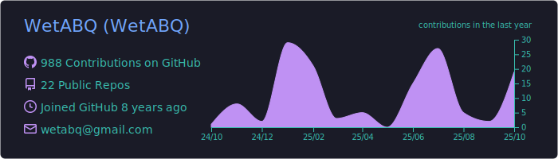
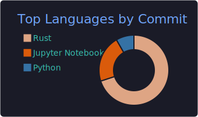
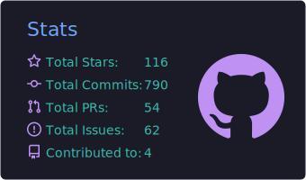

<h2 align="center">Hello! 👋 WetABQ here!</h2>

<!--Blog-->

<!--Systems-->

<!--Databases-->

<!--Languages-->

<!--Summary Card-->

<a href="https://github.com/vn7n24fzkq/github-profile-summary-cards">

</a>
